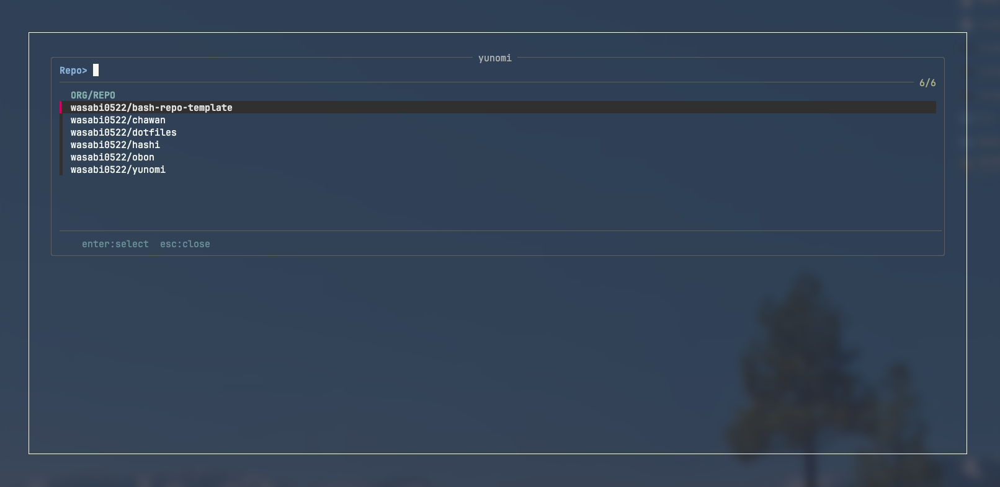
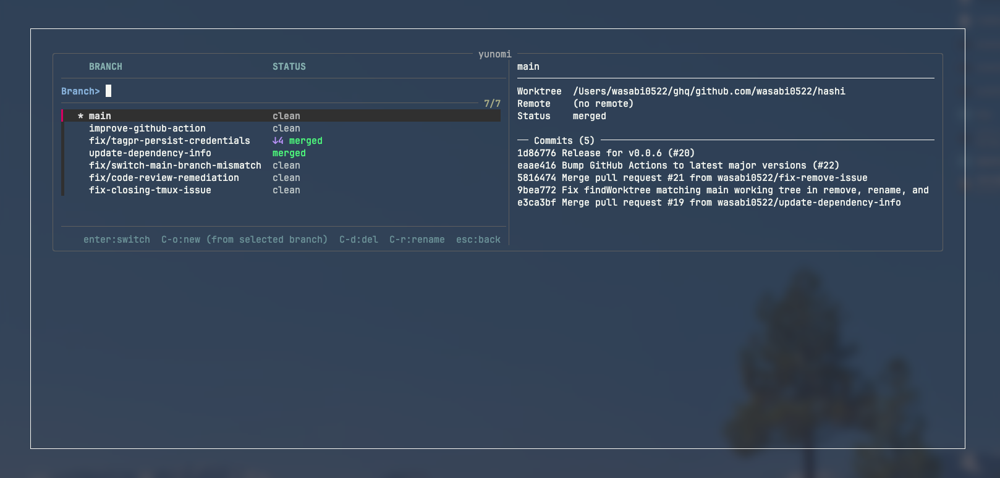

<div align="center">

# 🍵 yunomi (湯呑)

**Browse ghq repositories and operate git & tmux together in a popup**

[](https://github.com/wasabi0522/yunomi/actions/workflows/ci.yml)
[](LICENSE)


</div>

## Features

Two-screen fzf popup that connects [ghq](https://github.com/x-motemen/ghq) repositories to [hashi](https://github.com/wasabi0522/hashi) — a tool that manages git branches, worktrees, and tmux windows at once.

- **Repository search** — fuzzy search across all ghq-managed repositories
- **Git & tmux operations** — switch, create, delete, and rename via hashi (branch + worktree + tmux window at once)
- **Live preview** — worktree info, commit log, and changed files in a side pane
- **MRU sorting** — repositories by `.git/HEAD` mtime, branches by committer date
- **Configurable** — trigger key, popup size, preview position, keybindings, and sort order

## Installation

> [!NOTE]
> Requires **bash 4.0+**, **tmux 3.3+**, **fzf 0.63+**, **[ghq](https://github.com/x-motemen/ghq)**, **[hashi](https://github.com/wasabi0522/hashi)**, and **jq**.
> macOS ships with bash 3.2. Install bash 4+ via Homebrew (see below).

### Prerequisites

```bash
brew install bash fzf ghq jq wasabi0522/tap/hashi
```

### With [TPM](https://github.com/tmux-plugins/tpm) (recommended)

Add to your `~/.tmux.conf`:

```tmux
set -g @plugin 'wasabi0522/yunomi'
```

Then press `prefix + I` to install.

<details>
<summary>Manual installation</summary>

Clone the repository:

```bash
git clone https://github.com/wasabi0522/yunomi.git ~/.tmux/plugins/yunomi
```

Add to your `~/.tmux.conf`:

```tmux
run-shell ~/.tmux/plugins/yunomi/yunomi.tmux
```

Reload tmux:

```bash
tmux source-file ~/.tmux.conf
```

</details>

## Usage

Press `prefix + G` (default) to open the popup.

**Screen 1 — Repository selection:**

| Key | Action |
|-----|--------|
| `Enter` | Select repository → go to Screen 2 |
| `Esc` | Close popup |



**Screen 2 — hashi operations:**

| Key | Action |
|-----|--------|
| `Enter` | Switch (`hashi switch`) |
| `Ctrl-o` | Create (`hashi new`) |
| `Ctrl-d` | Remove (`hashi remove`) |
| `Ctrl-r` | Rename (`hashi rename`) |
| `Esc` | Back to Screen 1 |



## Configuration

All options are set via tmux user options in `~/.tmux.conf`.
Defaults work out of the box — no configuration required.

| Option | Default | Description |
|--------|---------|-------------|
| `@yunomi-key` | `G` | Trigger key after prefix |
| `@yunomi-popup-width` | `80%` | Popup width |
| `@yunomi-popup-height` | `70%` | Popup height |
| `@yunomi-preview` | `on` | Preview pane (`on` / `off`) |
| `@yunomi-repo-sort` | `name` | Repository sort order (`name` / `mru`) |
| `@yunomi-branch-sort` | `name` | Branch sort order (`name` / `mru`) |
| `@yunomi-bind-new` | `ctrl-o` | Keybinding for create |
| `@yunomi-bind-delete` | `ctrl-d` | Keybinding for delete |
| `@yunomi-bind-rename` | `ctrl-r` | Keybinding for rename |

<details>
<summary>Example configuration</summary>

```tmux
set -g @plugin 'wasabi0522/yunomi'

# Open with prefix + R
set -g @yunomi-key 'R'

# Larger popup
set -g @yunomi-popup-width '90%'
set -g @yunomi-popup-height '80%'

# Sort by most recently used
set -g @yunomi-repo-sort 'mru'
set -g @yunomi-branch-sort 'mru'

# Custom keybindings
set -g @yunomi-bind-new 'ctrl-n'
set -g @yunomi-bind-delete 'ctrl-x'
```

</details>

## License

[MIT](LICENSE)
